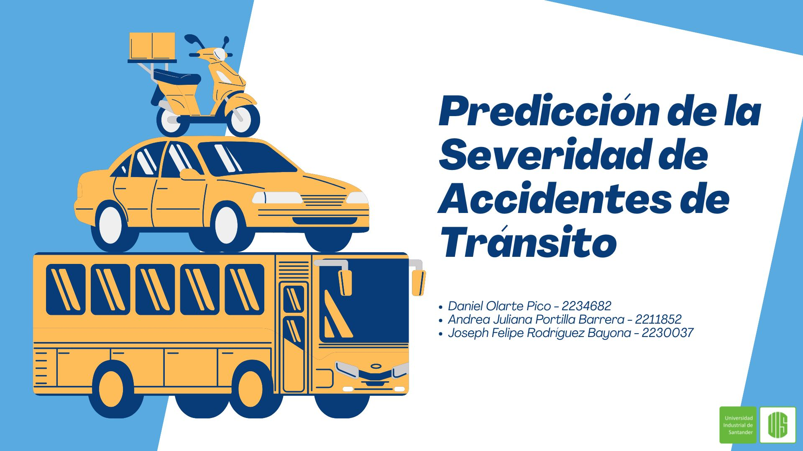

# **Predicción de la Severidad de Accidentes de Tránsito**

## Objetivo General
Desarrollar un sistema de predicción de la severidad de accidentes de tránsito mediante técnicas de machine learning y deep learning. El proyecto abarca desde la exploración y limpieza de los datos hasta el entrenamiento, optimización y comparación de múltiples modelos, con el fin de identificar los factores más determinantes en la gravedad de los siniestros viales y sentar las bases para el desarrollo de una herramienta de apoyo a la gestión y prevención de accidentes en Colombia.

## Enlace video

## Enlace diapositivas
[Ver pdf](Predicción_Severidad_Accidentes_Tránsito.pdf)

## Enlace Google Colab
Puedes ver el código completo en [Predicción_Severidad_Accidentes_Tránsito](Predicción_Severidad_Accidentes_Tránsito.ipynb).

## **Autores**
- Daniel Olarte Pico
- Andrea Juliana Portilla Barrera
- Joseph Felipe Rodriguez Bayona

**Universidad Industrial de Santander — Ingeniería de Sistemas e Informática**

Inteligencia Artificial I — 2026
